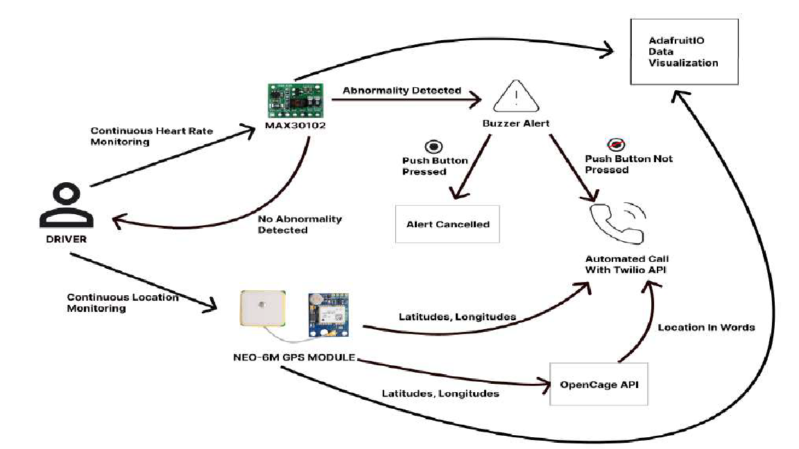
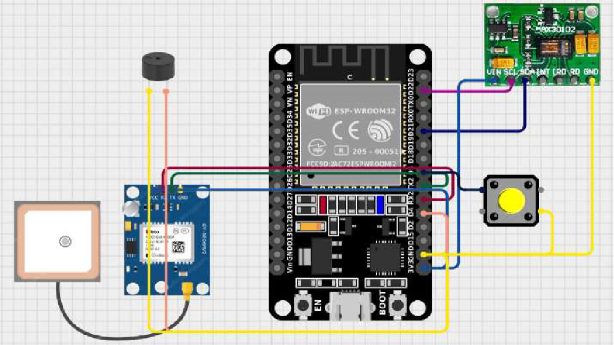

# AutoPulse
> Driver's Heart-Rate Monitoring and Alert System

## Overview
This project is an IoT-based edge-computing system designed to ensure driver safety by continuously monitoring their heart rate. Designed as an independent, standalone device within the vehicle, it processes sensor data locally without relying on external mobile applications. 

If an abnormal heart rate is detected, the system provides a 10-second audible warning. To prevent false positives, the driver can manually cancel the alert. If the driver is unresponsive, the microcontroller automatically dispatches an SMS and places an emergency call to a predefined contact, providing the driver's exact location coordinates converted into a readable street address.

## Core Features
* **Real-Time Embedded Monitoring:** Continuously tracks the driver's heart rate using optical photoplethysmography (PPG) via the MAX30102 sensor.
* **False-Alarm Mitigation:** Implements a hardware polling window allowing the driver 10 seconds to cancel the alert via a push button.
* **Automated M2M Emergency Response:** Utilizes the Twilio API to autonomously execute emergency voice calls and SMS alerts over an internet connection.
* **Hardware GPS Tracking:** Fetches real-time latitude and longitude coordinates using a dedicated NEO-6M GPS module.
* **Dynamic Geocoding:** Integrates the OpenCage API to convert raw GPS coordinates into human-readable locations for emergency contacts.

## System Architecture

This system operates at IoT Level 3, featuring direct Machine-to-Machine (M2M) communication. The microcontroller processes all physiological data and handles operational logic internally, relying on external network connectivity only for remote API alerts, without requiring cloud data storage.

## Hardware Components

* **ESP32 Microcontroller:** Core processing and Wi-Fi communication unit.
* **MAX30102 Heart Rate Sensor:** Communicates via the I2C protocol to provide pulse data.
* **NEO-6M GPS Module:** Communicates via the UART protocol to provide location tracking.
* **Active Buzzer & Push Button:** For the localized alert and cancellation mechanism.
* **Power Supply:** Operates on a standard 5V battery or vehicle power source.

## Software & Technologies
* **Language & Environment:** C++ developed in the Arduino IDE.
* **External APIs:** Twilio API (Communications) and OpenCage API (Reverse Geocoding).
* **Core Libraries:** `WiFi.h`, `HTTPClient.h`, `Wire.h`, `MAX30105.h`, `TinyGPS++.h`, and `base64.h`.

## Project Contributors
* **Ramya M**
* **Harshan Kumar S**
* **Jerrish Abraham J**
